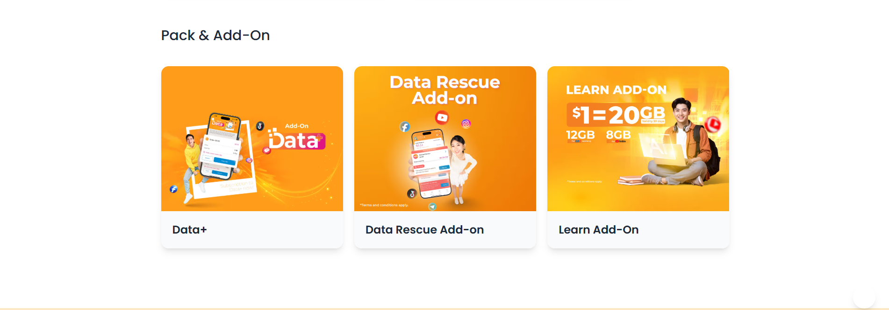
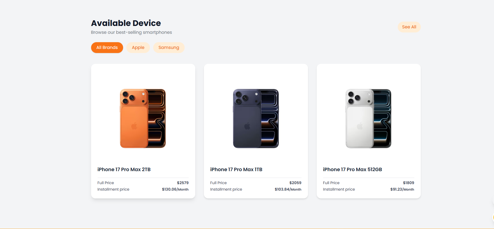
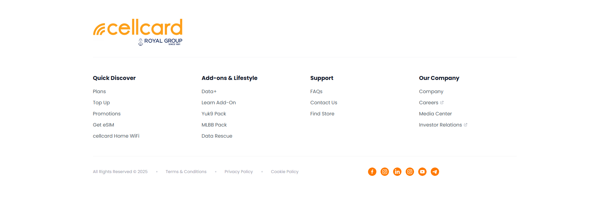
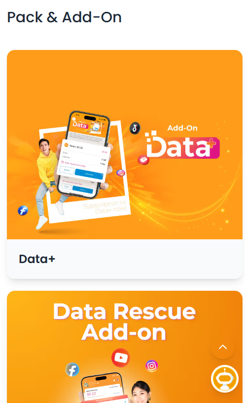
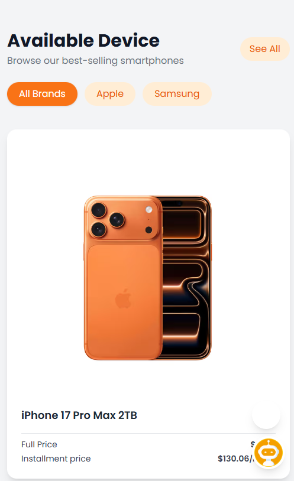
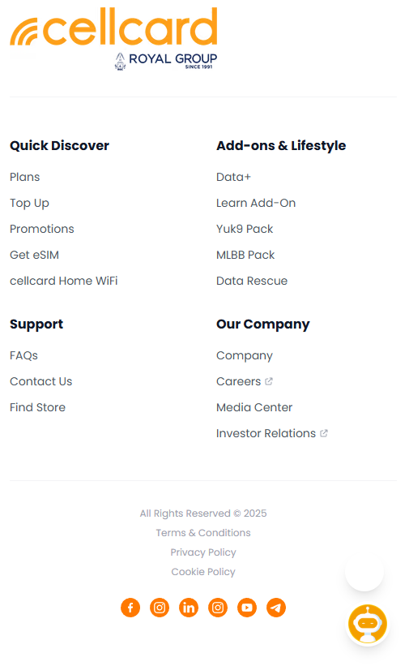
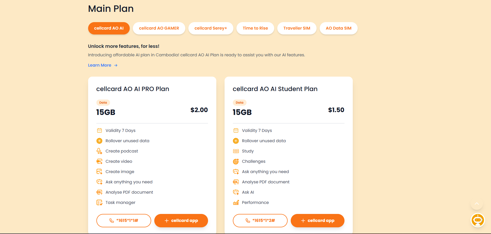

# Cellcard Landing Page

## Live Demo
[View Live Demo on GitHub Pages](https://vanreuth.github.io/Cellcard/)

## Screenshots

### Desktop View









### Mobile View









## Implemented Features

### Responsive Design
- Mobile: 320px–480px
- Tablet: 481px–1024px
- Desktop: 1025px+

### Navigation Bar
- Sticky navigation that changes background color on scroll
- Working mobile hamburger menu
- Smooth scroll to sections

### Hero Section
- Gradient background with hero image
- Headline, subtext, and CTA

### Quick Action Buttons
- Get SIM, Top Up, Promotion, Find Store

### Main Plan Section
# Cellcard Landing Page

## Live Demo
[View Live Demo on GitHub Pages](https://vanreuth.github.io/Cellcard/)

## Screenshots

### Desktop View



### Mobile View


## Features

- **Responsive Design:** Mobile (320px–480px), Tablet (481px–1024px), Desktop (1025px+)
- **Sticky Navigation Bar:** Changes background color on scroll
- **Mobile Hamburger Menu:** Opens/closes navigation on small screens
- **Smooth Scroll:** Navigation links smoothly scroll to sections
- **Hero Section:** Gradient background, hero image, headline, CTA
- **Quick Action Buttons:** Get SIM, Top Up, Promotion, Find Store
- **Main Plan Section:** Tabbed plans, plan cards
- **Pack & Add-On Section:** Data+, Data Rescue, Learn Add-On
- **SIM Only Section:** eSIM and SIM YUk9
- **International Services:** Roaming info and image
- **Digital Lifestyle:** Gaming, Other, Home Wi-Fi
- **Device Showcase:** Product cards for iPhone models
- **Support Section:** Messenger and Telegram contact
- **Footer:** Navigation links, social media icons
- **Interactive Elements:** Hamburger menu toggle, navbar scroll effect, CTA hover, smooth scroll

## Technologies Used
- HTML5
- CSS3
- Tailwind CSS (via CDN)

## Credits

### Images & Icons
- All images and icons are from the `assets/images` and `assets/icon` folders, provided for educational/demo use only.

### Fonts
- Poppins font family: [Google Fonts](https://fonts.google.com/specimen/Poppins)

## How to Run the Project Locally

1. **Clone the repository:**
   ```bash
   git clone https://github.com/yourusername/Cellcard-Html-tailwind-.git
   ```
2. **Navigate to the project directory:**
   ```bash
   cd Cellcard-Html-tailwind-
   ```
3. **Open `index.html` in your web browser:**
   Run with open with live server
4. **Open your browser and go to** `http://localhost:5500`

## Project Structure
```
Cellcard-Html-tailwind-/
├── index.html
├── README.md
├── assets/
│   ├── icon/
│   │   └── ... (icon files)
│   ├── images/
│   │   └── ... (image files)
│   └── screenshot/
│       ├── desktop.png
│       └── mobile.png
└── (other asset files)
```
